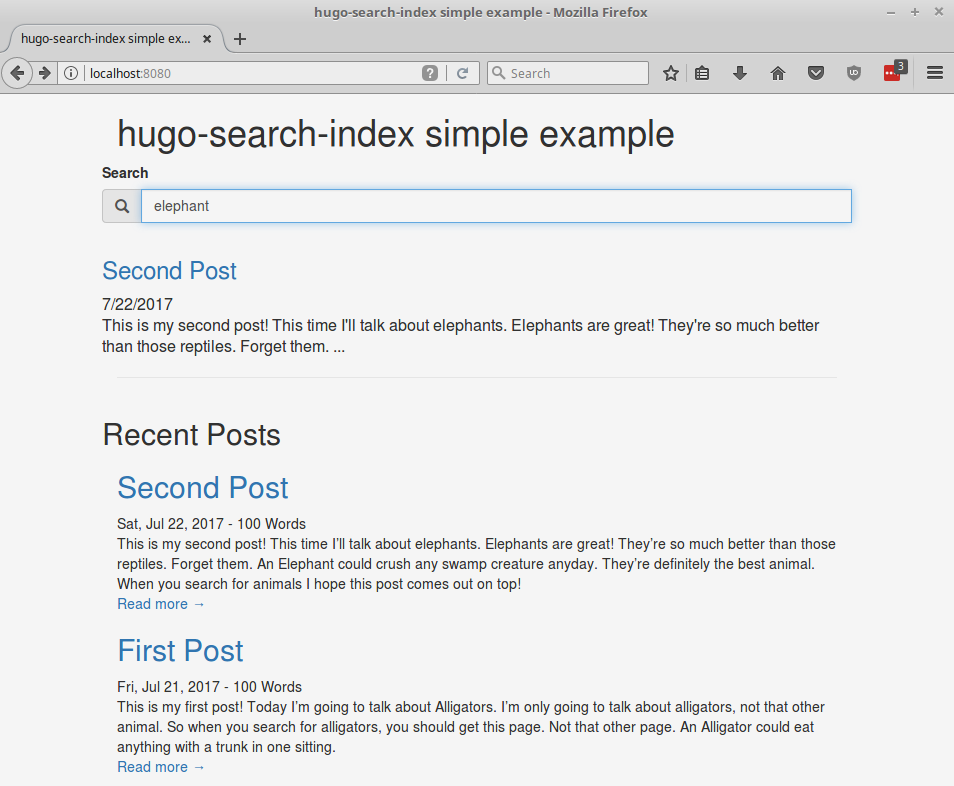

# Simple example

A barebones bootstrap hugo site to show off the way this library works.  To get it working:

1. install dependencies using npm
```bash
$ npm install
```

2. run gulp to build the site to the `public` folder
```bash
$ node_modules/.bin/gulp build
```

3. serve it using http-server and open your browser to http://localhost:8080
```bash
$ node_modules/.bin/http-server
```

### Example:





## How it works:

There's two parts to the magic here.  The first happens in the gulpfile.  We need to use the [search-index](https://github.com/fergiemcdowall/search-index/) library
to build a file which contains an index of all our markdown content.  Gulp allows us to do that, because it's just a nodejs program.  
`hugo-search-index/gulp` contains gulp tasks to build the index.  All you have to do is require it and then put the "search" task
as a dependency of your "build" task.

### Part 1 - Gulpfile

```js
const gulp = require('gulp')

// import search index tasks
const registerTasks = require('hugo-search-index/gulp')
registerTasks(
    // we have to give our "gulp" to the library so it can create the task we need.
  gulp, 
    // we can also give it the console so that it can write log entries.  But we don't have to.
  console
)

gulp.task("default", ["build"]);

/** 
 * "build" relies on "search".
 * "search" is imported from 'hugo-search-index/gulp' above.
 */
gulp.task("build", ["search"]);
```
Now if you type `gulp build` it will create a gzipped file in the `public/` directory called `search_index.gz`.  This file contains the index of all your markdown files
in the `content/` directory.

In this example the gulpfile is a little more complicated, because we're also going to call hugo to build the site using gulp.  But you don't have to
do that, you can do it however you want.

### Part 2 - Search form

The second part is downloading and importing that gzipped file into the browser.  For this we use the browserified version of search-index, `search-index.min.js`.
The gulp task deposits that javascript file inside `public/js/` so all you have to do is include it in your page.  
The gulp task also gives you `search.min.js` which contains the logic to download, extract, and load `search_index.gz` into the in-browser search-index.  It also
automatically looks for a form with id `#searchForm` and wires up to the onSubmit event of that form.  If you also have a table with id `#searchResults` it will
automatically deposit the results of the search as rows in the table.

This is what we do in `layouts/index.html`, which defines the homepage.  We have a form:
```html
<form id="searchForm">
  <div class='form-group has-feedback'>
    <label for="search">Search</label>
    <div class='input-group'>
      <span class="input-group-addon"><i class='glyphicon glyphicon-search'></i></span>
      <input type="search" class='form-control' id='search' placeholder="Search..."></input>
      <i id="searchSpinner" class="fa fa-spinner fa-spin" aria-hidden="true"></i>
    </div>
  </div>
</form>
```

and we have a separate table for the search results:
```html
<div class='row'>
  <table id="searchResults">

  </table>
</div>
```

Then we include the scripts and it wires everything up automatically!
```html
<script src="/js/search-index.min.js" ></script>
<script src="/js/search.min.js" ></script>
```